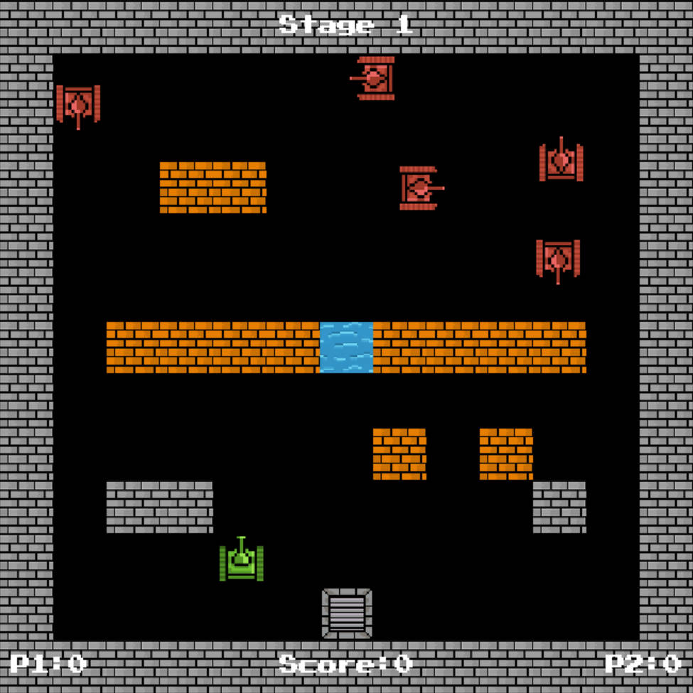
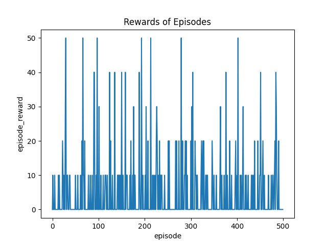
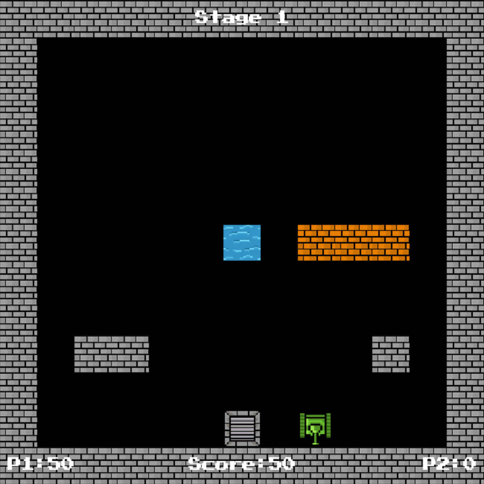

# 基于DQN算法的坦克大战游戏探究


<div style="display:flex">
  
</div>


## 1. 项目简介
本项目是基于坦克大战游戏的AI探究项目，主要使用了深度强化学习中的DQN算法，通过对游戏的状态进行编码，将游戏的状态作为DQN的输入，输出为游戏的动作，从而实现AI的自动控制。本项目主要包含以下内容：
- 坦克大战游戏的实现
- 坦克大战游戏的AI实现
- 坦克大战游戏AI的训练
- 坦克大战游戏AI的测试
- 坦克大战游戏AI的可视化
## 2. 项目环境
- Python 3.9
- Pytorch 1.12.1
- Pygame 2.4.0
- Numpy 1.21.6
- Matplotlib 3.3.4
- Pillow 9.5.0
- Pyglet 1.5.0
- Gym 0.21.0
```
项目所使用的软件运行环境可通过此链接下载：
https://pan.baidu.com/s/1ZBDtCevIL4ix_SbtKn017A?pwd=cvi2 
提取码：cvi2 
```
## 3. 项目结构
``` 
├── model
│   ├── model relevant files
├── param
│   ├── checkpoint.pth
├── graph
│   ├── experiment pictures
├── output
│   ├── train
│   ├── test
├── tankbattle
│   ├── environment relevant files
├── venv
│   ├── python packages files
├── plot.py
├── train.py
├── test.py
├── README.md
```
## 4. 项目运行
### 4.1 训练
```bash
python train.py
```
### 4.2 测试
```bash
python test.py
```
### 4.3 可视化
```bash
python plot.py
```
## 5. 项目效果
### 5.1 训练


### 5.2 测试



## 6. 参考资料
- [1] [DQN算法实践之速通超级马里奥](https://www.jianshu.com/p/88f050fe4f67)
- [2] [使用强化学习玩超级马里奥游戏](https://github.com/xiaoyou-bilibili/gym_super_mario)


